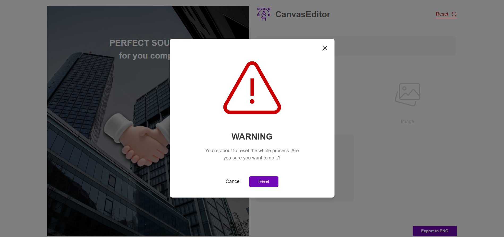

# Canvas Editor

A simple React-based canvas editor allowing users to add, edit, and remove text and image elements. Users can also upload a background image and export the final canvas as an image file.

## Features

- Add and edit text elements with customizable colors.
- Add and resize image elements.
- Upload custom background images.
- Export the canvas as a PNG image file.
- Simple, user-friendly interface.

## Tech Stack

- React
- TypeScript
- Tailwind CSS
- react-rnd (for resizable and draggable elements)
- html2canvas (for exporting the canvas as an image)

## Screenshots

### Start

### Adding Text Element

### Adding Image Element

### Warning

### Final view

## Demo

[Watch the demo](https://konrad-canvaseditor.netlify.app/)
